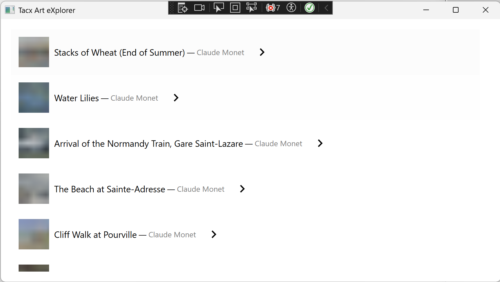

# Tacx Art Explorer

This is the Tacx Art Explorer project, which is the assignment for my interview process at Tacx.

It can be used to browse artworks from the [Art Instituate of Chicago](https://www.artic.edu/). All the images and provided meta data is originally sourced from the [Artic API]((https://api.artic.edu/docs/#introduction) )

More detailed information about the requirements of this assignment can be found in the [assignment description](.\Test assignment for Windows desktop developer.pdf)

## Setup

*Db setup here*

## Design

Tacx Art Explorer has two main views, the art list view and art detail view. These views allow the user to browse artworks of the Art Institute of Chicago. The list view allows for a quick overview of all artworks by a specific artist. Clicking one of the list items opens up a detail view which displays more information as well as an image of the artwork itself. Using the back button one can navigate back to the main list view, or browse other artworks in detail using the previous and next buttons.

## Architecture

The Tacx ArteXplorer project makes use of the MVVM framework in combination with a network of services that are provided to their respective viewmodels via dependency injection. Below is a list of the different services and their use:

**ArtApiService**

Responsible for querying the Artic API using custom HTTPclients and retrieving and parsing the resulting data into a format that can be used by the application. DTOs are used to separate the APIs format from the domain models, which are translated using the DTOMapper. 

**CacheService**

Responsible for caching the result from the API in a local database. This is not yet implemented but will make use of a lightweight sql database such as sqlite to store and retrieve artworks.

**ArtService**

Wrapper class that combines the logic of the ArtApiService and the CacheService to provide a fail safe way of retrieving Artworks, irrespective of the current data connectivity (internet, data)

**NavigationService**

The navigation service is used throughout the application to provide relevant viewmodels to the mainwindow. This way viewmodels can be context aware of the other viewmodels and effect the global application state whilst keeping them as DRY and loosely coupled as possible.

 

## Roadmap

- [ ] Models
  - [x] Artist
  - [x] ArtPiece
  - [x] ArtPieceImage
  - [x] DTOs
  - [x] DTO mapper
- [ ] Services
  - [ ] Art Api Service
    - [x] Artworks search by artist
    - [ ] Image search by id
  - [ ] Art Service
    - [x] api fallback logic
    - [ ] timed data resync
      - [ ] Cache 
  - [ ] Cache service
    - [ ] db initialization / setup
    - [ ] store
    - [ ] retreive
    - [ ] invalidate
- [ ] Views
  - [ ] list view
    - [ ] List view item
    - [ ] Drag from top refresh
    - [ ] Menu bar
    - [ ] Progress indicator
  - [ ] Detail view
    - [ ] Back button
    - [ ] Image view
      - [ ] Focus on image
      - [ ] Title overlay
    - [ ] Detail meta data
    - [ ] move buttons
- [ ] Logic (ViewModels)
- [ ] Testing
  - [ ] Service testing

## Licenses

All data is provided by the Artic API, which is provided by the Art Institute of Chicago.

The `description` field in the metadata response is licensed under a Creative Commons Attribution 4.0 Generic License (CC-By) and the Terms and Conditions of artic.edu. All other meta is licensed under a Creative Commons Zero (CC0) 1.0 designation and the Terms and Conditions of artic.edu

More information:
[CC 1.0](https://creativecommons.org/publicdomain/zero/1.0/)

[Artic Terms](https://www.artic.edu/terms)	